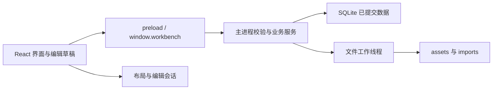

# 小说工作台 Agent 开发说明与实施计划

> **For agentic workers:** 执行时使用 `superpowers:executing-plans` 逐项实施；用户选择分工执行时再使用 `superpowers:subagent-driven-development`。其他 agent 没有这些技能也可按本文施工，不需要安装插件。用复选框记录任务状态，未验证的项目不得勾选。

**Goal：** 完成 Windows 本地小说工作台 0.1，让作者在同一软件内准备资料、写作、保存、回退和备份。本轮交付的是开发说明，所有开发任务均未开始。

**Architecture：** React 管界面和未提交草稿；预加载层只提供有限业务接口；Electron 主进程校验请求并串行写 SQLite。素材原件放在项目文件夹中，耗时文件处理放到工作线程。一个主窗口一次打开一个项目，业务数据、布局和编辑会话分别管理。

**Tech Stack：** React、TypeScript、electron-vite、Electron、Dockview、Tiptap、better-sqlite3、CSS Modules、electron-builder。Vitest 测纯逻辑，Electron 运行环境测实际数据库，Playwright 测关键桌面交互。

**Spec：** [小说工作台产品需求与技术设计说明书 0.2](../../../2026-10-04-novel-workbench-desktop-design.md)，日期 2026-10-04。本文补齐施工顺序、文件职责、接口和验收归属，不替代产品规则。

## 1 开工入口与当前事实

截至 2026-10-04，仓库有上述 Markdown 说明书及 Word 说明书，没有应用代码、package.json、锁文件、旧网页源码或 schema 2 导出样本。所有下文源码路径都是拟创建路径，不代表已有实现。保留现有文档及用户文件。

阅读顺序：用户最新要求与 AGENTS.md 指令 → 产品说明书第 2 至 12 章 → 本文第 2 至 7 节 → 本次任务。旧聊天附件中的 AI 架构稿已经被 0.2 版取代，不能据此添加 AI 功能。

每次接单只执行指定任务；未指定范围时，第一轮建议为 M0 的 T00 至 T02。产品问题以说明书为准，技术细节以本计划为实施默认值。发生冲突时指出冲突，只暂停依赖该结论的部分，不自行改产品规则。

### 1.1 本文新增的实施默认值

以下是为减少 agent 自行发挥而作的实现选择，不是已经通过实测的结论。

| 项目 | 实施默认值 | 改动条件 |
| --- | --- | --- |
| 包管理 | npm，单仓库、单 package.json，提交 package-lock.json | 已有工程建立后沿用，不混用包管理器 |
| 版本 | 开发机先验证 Node.js 24 LTS；依赖在 T00/T02 核对并锁定实际版本 | 兼容性不满足时记录证据再调整 |
| 状态 | React hooks 与少量按对象 ID 索引的共享状态 | 实际需求证明不足后再考虑状态库 |
| 数据访问 | 服务函数直接使用预编译 SQL 和事务 | 不创建通用 Repository、ORM 或依赖注入框架 |
| 检索 | 200 ms 防抖，默认每页 50 条，上限 100 条 | 基准测试证明需要调整时同步修改测试 |
| 初始 schema | 数据库版本从 1 起，workspace layoutSchemaVersion 从 1 起 | 两种版本独立递增 |
| 文本节点 | doc、paragraph、text、heading（1 至 3 级）、hardBreak；bold、italic 标记 | 新增节点必须同时补持久化、粘贴和导出规则 |
| ZIP 实现 | 到 T11 才选择支持流式处理和条目检查的现成库，锁版本及许可 | 不自行实现 ZIP，不调用用户未安装的外部压缩程序 |

### 1.2 已知缺口及影响

| 缺口 | 处理方式 | 阻塞范围 |
| --- | --- | --- |
| 没有 schema 2 原型源码或真实导出文件 | T12 前取得样本与字段来源，制作脱敏样本及映射表；不能按字段名称猜测 | 只阻塞 T12 的真实迁移验收及最终 AC19 |
| 没有已锁定的运行依赖 | M0 核对版本、许可、Windows 支持与原生模块 | 阻塞 M0 后的大规模页面实现 |
| 尚无 Windows 安装及输入法实测 | M0 和 M4 记录实际系统、输入法、安装包和结果 | 阻塞对应阶段验收 |
| 代码签名尚未决定 | M4 如实注明签名状态；不自行购买证书 | 不妨碍本地开发，不宣称发布者已验证 |

## 2 全局约束

这些要求适用于所有任务，不因任务卡没有重复而失效。

- 首版为单人、单机、离线软件，交付 Windows x64。Windows 10 22H2 与 Windows 11 是拟覆盖环境，实际支持范围以 M0/M4 记录为准。
- 不实现 AI、API Key、DSH、聊天、自动拆书、Skill 执行、云同步、账号、多人协作；也不建对应占位按钮、空接口或预留任务系统。
- 悬浮面板位于主窗口内部；完整视图是同一业务对象的另一种显示方式。跨显示器系统窗口、PDF/EPUB/DOCX 正文解析、跨作品素材库属于后续。
- 所有业务面板，包括目录和正文，都能关闭。全关闭的空布局合法；关闭视图不得删除内容。
- 正式业务数据存 SQLite，原件存项目目录。localStorage 不作为正式数据源，也不自动读取旧浏览器的数据。
- 所有业务删除均为软删除，保留引用。本期不提供物理清空，也不自动清理按哈希保存的原件。
- 正文保存停止输入约 500 ms 后触发；连续已确认输入最长约 5,000 ms 提交一次。输入法组合文字不提交。
- 正文变化时约每 10 分钟产生自动检查点，每章只清理超出最近 30 个的自动检查点；手动、定稿和恢复前版本长期保留。
- 原件上限 100 MiB，文本解析上限 20 MiB，恢复总解压上限 5 GiB。MiB/GiB 按 1024 进制计算；这些是 PRD 初始限制，M0 可依据实测提出调整。
- 不承诺断电恢复从未提交的输入。正常关闭必须等待保存完成；失败时保留草稿并提供重试、导出或明确放弃。
- 不擅自替换技术栈，不购买服务，不扩大功能范围，不整理无关代码。不生成未使用的空目录、抽象层或全套测试框架。对确有上限的取舍，例如 LIKE 全文扫描，用一条 ponytail 注释注明适用规模与升级条件。
- 改动后只运行足以证明该任务的局部检查。公共契约、持久化或跨模块行为改变时才扩展相关检查；全量发布验收留到 M4。

## 3 架构和文件职责



主进程是唯一业务写入入口。文件工作线程处理哈希、文本解码、压缩和解压，只返回处理结果；数据库提交由主进程完成。不要另开 HTTP 服务，也不要让工作线程自行修改业务数据库。

### 3.1 拟创建的文件

按当前任务增量创建，不先搭空架子。文件过大时只按已经出现的职责拆分。

| 路径 | 职责 | 首次归属 |
| --- | --- | --- |
| package.json、package-lock.json、electron.vite.config.ts、electron-builder.yml、tsconfig*.json | 依赖、构建、类型检查和 Windows 打包 | T00 |
| src/main/index.ts | 主窗口、安全选项、应用启动 | T00 |
| src/preload/index.ts | 明确方法名的桥接接口及事件取消订阅 | T00/T01 |
| src/renderer/index.html、main.tsx、App.tsx、styles.css | React 入口、应用框架和基础主题 | T00 |
| src/shared/types.ts、validation.ts、text.ts | 数据契约、运行时校验、纯文本和字符偏移 | T01 |
| src/main/ipc.ts | IPC 白名单、来源和项目校验、响应封装 | T01 |
| src/main/data/database.ts、schema.sql、migrations.ts | 连接、建表、迁移入口 | T01 |
| src/main/services/project.ts、documents.ts | 项目打开/关闭及文档写入 | T01/T03 |
| src/renderer/features/editor/EditorPanel.tsx、sessions.ts | 编辑器视图与每章唯一逻辑会话 | T02 |
| src/renderer/workspace/Workspace.tsx、panels.ts、workspaceState.ts、Workspace.module.css | 面板身份、停靠、放大和布局持久化 | T02/T05 |
| src/renderer/features/project/ProjectHome.tsx、ChapterTree.tsx | 项目选择与目录操作 | T03 |
| src/renderer/features/editor/saveQueue.ts、src/main/lifecycle.ts | 保存调度、关闭/切换/退出握手 | T04 |
| src/main/services/settings.ts、src/renderer/features/settings/SettingsPanel.tsx | 已支持设置与最近项目 | T05 |
| src/renderer/features/documents/DocumentPanel.tsx、src/main/services/records.ts | 大纲、笔记、文风与样本的复用表单 | T06 |
| src/renderer/features/beats/BeatsPanel.tsx、entities/EntitiesPanel.tsx | 剧情卡、设定及其关联编辑 | T07 |
| src/main/services/materials.ts、src/main/workers/files.ts、src/renderer/features/materials/MaterialsPanel.tsx | 素材导入、阅读和摘录 | T08 |
| src/main/services/search.ts、src/renderer/features/search/SearchPanel.tsx | 字面检索与定位 | T09 |
| src/main/services/revisions.ts、src/renderer/features/versions/VersionsPanel.tsx | 正文版本、定稿与恢复 | T10 |
| src/main/services/backup.ts、src/renderer/features/backup/BackupDialog.tsx | 整项目备份、恢复和进度 | T11 |
| src/main/services/legacyImport.ts、src/renderer/features/import/LegacyImportDialog.tsx | schema 2 转换与报告 | T12 |
| src/main/services/export.ts、src/renderer/features/export/ExportDialog.tsx | TXT/Markdown 导出 | T13 |
| tests/unit、tests/integration、tests/e2e、tests/fixtures | 按任务添加的最小验证与脱敏样本 | 随任务 |
| docs/development-progress.md | 任务状态、M0 版本记录、验证结果、接续入口 | T00 |

`entities/EntitiesPanel.tsx` 的完整路径为 `src/renderer/features/entities/EntitiesPanel.tsx`。业务模块的 CSS 放在模块旁边，确有样式需要时再添加。

### 3.2 状态的存放位置

| 状态 | 保存位置 | 规则 |
| --- | --- | --- |
| 作品、正文、卡片、素材、关联、版本 | project.sqlite | 已提交数据的唯一正式来源 |
| 未提交正文、保存队列、选区、滚动、撤销历史 | 当前项目的编辑会话内存 | 面板换位置不能重建逻辑会话 |
| 基础布局、活动章节、可恢复选区和滚动 | workspace_state | 不含正文，不持久化临时放大状态 |
| 全局字体、主题、字号、行距、最近项目 | Electron userData 下 settings.json | 主进程临时写入后替换；不加入作品备份 |

同一章以 `chapterId` 复用逻辑会话。简略和完整视图共享对象 ID；成功写入后只更新修订和保存标记，不把响应中的旧文本塞回编辑器。

## 4 数据与业务契约

### 4.1 项目目录及基础字段

```text
作品目录/
  project.sqlite
  assets/<sha256>                 # 原件按内容哈希保存，原文件名在数据库
  imports/<importId>/source.json  # 旧 JSON 原始字节
  imports/<importId>/report.json
```

运行时数据库可能产生 WAL/SHM 文件。备份不直接复制活动中的数据库主文件，移动整个项目前先关闭项目。临时文件单独命名，成功前不展示成正式条目。

可编辑记录使用 UUID、UTC 毫秒时间戳、`revision`、`deleted_at`、`trash_batch_id`。创建修订为 1；成功修改递增一次。数据库列采用 snake_case，IPC 字段采用 camelCase。关系唯一约束、外键及短事务是真正约束，不只依赖前端禁用按钮。

数据库采用 `foreign_keys=ON`、`journal_mode=WAL`、`synchronous=FULL`、`busy_timeout=3000`。后续任务需要新表时添加迁移，不重建用户项目。尚未完成 T14 的升级能力时，旧 schema 项目必须明确拒绝写入，不偷偷升级。

### 4.2 对象和关系

具体列以 PRD 8.2 为基础；以下补齐跨任务必须一致的语义。

| 对象 | 固定约定 |
| --- | --- |
| documents | kind 为 chapter、outline、note、style、sample；chapter 状态为 draft/final。持久化 content_json、plain_text、word_count、summary、notes |
| volumes / chapters | volume_id 可空，空值表示未分卷。sort_order 为整数；一次重排在事务内重编号，不引入分数排序 |
| outlines | parent_id 只能指大纲，不能成环；volume_id 可关联分卷，章节通过 chapter_outline 关联。根级未关联分卷的大纲提供全书概要 |
| notes / styles / samples | 可独立存在；新增 chapter_documents 关系表承接本章笔记、选用规则和样本，避免滥用大纲 parent_id |
| beats | 必须属于一个未删除章节；移动保留 ID，复制创建 ID 并复制关联；排序不改正文 |
| entities | type 为 character、scene、prop；自由内容和作者摘要分开 |
| materials | type 为 excerpt、book、document；favorite 与 inbox 独立；原件与摘录条目各有 ID |
| document_revisions | reason 为 manual、final、before_restore、checkpoint；保存正文 JSON、纯文本与 source_revision，不可原地修改 |
| workspace_state | 布局版本、基础布局、活动章节与视图状态；合法空布局不等于损坏布局 |

除新增 `chapter_documents` 外，关系表沿用 PRD 的 material_tags、chapter_entities、beat_entities、chapter_materials、chapter_outline。关系写入必须验证两端存在、属于当前项目且类型正确。

软删除规则：删章节时同批删除当时未删除的剧情卡；此前已经删除的卡片不改批次。恢复只恢复本次实际删除的对象。单独恢复剧情卡时其章节若仍被删除，应提示先恢复章节。删除设定、素材或资料保留关联；已删除对象显示明确占位。删除分卷默认把章节移至未分卷；用户选择连同章节删除时才处理对应章节与剧情卡。笔记、文风、设定和摘录不因关联章节或原件被删而自动删除。

### 4.3 文本与来源定位

- 保存只接收本期支持的 Tiptap 文档结构。主进程校验 JSON，并在同一事务内生成 plainText、wordCount、revision。
- 字数为排除空白后的 Unicode 码点数，标点计入。例如 `countWords("城 A😀\n。") === 4`，不能用 JavaScript 字符串 length 直接统计。
- 摘录采用 0 起点、右开区间的 Unicode 码点偏移；先将 CRLF/CR 统一为 LF，不修剪正文，然后对同一份文本计算 UTF-8 SHA-256。
- locator 存 `{sourceRevision, textSha256, start, end}`；来源 ID 与摘录原文另存。hash 或修订变化时先判定定位是否可靠；首版可直接提示“来源已变化”，不自动猜位置。
- 搜索返回的命中位置也带来源修订。Tiptap 位置、UTF-16 字符索引与 Unicode 码点偏移必须显式转换，禁止混用。
- 摘要只由作者编辑；没填就显示“未填写摘要”。恢复布局、打开面板、编辑全文都不自动生成摘要。

## 5 IPC 接口与安全边界

### 5.1 通用请求响应

下列类型是待实现契约，不是已存在代码。所有业务方法返回 Promise；取消文件对话框作为 CANCELLED 返回，前端不弹错误警报。

```ts
type Request<T> = { requestId: string; projectId: string } & T;
type Result<T> =
  | { ok: true; requestId: string; data: T }
  | { ok: false; requestId: string; error: {
      code: string; message: string; retryable: boolean;
      currentRevision?: number;
    } };

type SaveDocumentRequest = Request<{
  documentId: string;
  expectedRevision: number;
  contentJson: EditorDocument;
}>;
type SaveDocumentData = {
  revision: number;
  savedAt: number;
  wordCount: number;
  status: "draft" | "final";
};
```

`EditorDocument` 在 types.ts 定义为第 1.1 节节点/标记的受限 JSON 联合类型，并用同一编辑 schema 做运行时检查。不可用 `any` 或任意 JSON 绕过校验。`Result` 中错误码在实现时收为字面量联合；基础码为 CANCELLED、INVALID_INPUT、INVALID_CONTENT、NOT_FOUND、PROJECT_BUSY、PROJECT_MISMATCH、REVISION_CONFLICT、WRITE_FAILED、UNSUPPORTED_SCHEMA。后续任务分别加入其需要的 IMPORT_FAILED、LIMIT_EXCEEDED、INVALID_BACKUP。

所有活动项目方法由主进程核对 projectId 及调用窗口；project.create/open、project.restore/importLegacy 和全局 settings 方法不要求预先打开项目。文件路径只由主进程系统对话框选取或从当前项目记录推导；不向渲染层开放任意路径读写、SQL、Node.js 或通用 IPC。

### 5.2 固定业务方法

表中省略了统一的 requestId/projectId 包装；具体对象载荷按第 4 节定义，不允许把整个数据库行当任意 patch。服务内部可用同步函数，预加载方法统一异步。

| 方法 | 输入与输出约定 | 归属 |
| --- | --- | --- |
| project.create / open / close | create 收 title；create/open 主进程选择目录，返回项目 ID、名称、schema、路径；close 需先完成保存握手 | T01/T03/T04 |
| project.rename | title、expectedRevision → 项目新修订；不移动目录 | T03 |
| document.list / read / create | kind/筛选，或 documentId；返回目录摘要或完整文档；create 返回新 ID 和修订 | T03 |
| document.save | SaveDocumentRequest → SaveDocumentData | T01/T04 |
| record.list / read / upsert | kind 白名单为 volume/document/beat/entity/material；新增不传 ID/expectedRevision，修改必须同时传；document 仅在此更新元数据，创建/正文走 document.create/save；entity 内容由 upsert 校验并生成纯文本 | T03/T06/T07/T08 |
| record.reorder | 同一父对象下的完整有序 ID 列表及各对象预期修订 → 更新后的顺序/修订；移动另带目标父 ID | T03/T07 |
| record.trash / restore | kind、ID、expectedRevision；trash 返回 batchId 和受影响 ID；restore 按删除批次恢复 | T03/T07 |
| relation.set | type、ownerId、targetIds、ownerExpectedRevision → 关系全集与 owner 新修订；同一事务替换该类型关系 | T06/T07/T08 |
| material.import / clip / openOriginal / relinkOriginal | import 通过对话框选文件；clip 接来源、locator 和摘录文本；open/relink 只接素材 ID；结果逐条返回 | T08 |
| search.query | query、kinds、page、pageSize → items、hasMore；结果带 kind、ID、标题、片段、修订与命中位置 | T09 |
| revision.list / read / create / restore | 章节/版本 ID；create 接 manual/final、label、expectedRevision，其余 reason 仅供内部流程；restore 含 expectedRevision，返回新正文/修订 | T10 |
| workspace.read / save | projectId、layoutSchemaVersion、校验后的布局/视图状态 → 保存结果 | T05 |
| settings.read / update | 允许字段的设置 patch → 持久化后的设置；最近路径由项目成功打开时写入 | T05 |
| project.backup / restore / importLegacy | 系统选择目标/源；返回 jobId；完成事件给出快照时间或新项目路径/报告 | T11/T12 |
| document.export | 格式 txt/md、范围 all/final 或所选章节 IDs；系统选择目标 → 导出结果 | T13 |
| document.exportDraft | 当前内存草稿的受限 JSON、标题；系统选择目标 → 导出结果；不依赖数据库可写 | T04 |
| job.cancel / onProgress | jobId 取消；onProgress 订阅返回取消订阅函数；进度含 jobId、阶段、已完成、总量及最终结果 | T08/T11/T12 |

长任务只做当前窗口需要的进度和取消，不建持久任务平台。切换项目/退出前等待或取消相关任务并完成清理；迟到事件不能写入新项目 UI。record.upsert 不能修改 ID、kind、revision、删除标记或任意关系；专用操作各走自己的接口。

### 5.3 Electron 安全要求

显式开启 contextIsolation、sandbox，关闭 nodeIntegration；生产页面设置 CSP，阻止未授权导航和新窗口。preload 只暴露 window.workbench 的白名单方法，主进程检查 IPC sender 和参数。导入 Markdown 作为文本展示，不执行 HTML/脚本。外链只在用户点击时允许安全的系统浏览器打开操作；原件只从已授权素材记录打开。上述边界依照 [Electron 官方安全说明](https://www.electronjs.org/docs/latest/tutorial/security)，实现后仍需实测。

日志只存操作、错误码、ID 与时间，不存正文。任何报错都不得伪装成保存成功。

## 6 三条不能返工的数据流程

### 6.1 正文保存和关闭

每章维护最新 draft、draftSeq、ackSeq、当前数据库 revision 和最多一个 inFlight 请求。draftSeq 是本地输入序号，不是数据库 revision。

1. 已确认输入增加 draftSeq，调度 500 ms 防抖和最长 5,000 ms 提交；组合输入期间等 compositionend。
2. 发送时固定 sentSeq 与正文副本；后续输入留在最新 draft，不能改正在发送的副本。
3. 成功响应仅更新已确认修订和 ackSeq。只有 ackSeq 等于当前 draftSeq 才显示“已保存”，否则继续调度；不调用 setContent 覆盖编辑器。
4. 冲突或写入失败保留草稿。冲突交给用户比较/选择，不自动拿新 revision 重发覆盖别人的修改。
5. Ctrl+S、关闭面板、切换项目、备份和退出触发 flush。主进程发带 requestId 的 flush 请求，渲染层在输入法组合结束并提交完最新草稿后回复；完成握手期间防止新增编辑。失败、超时或渲染层失联都不能按成功继续关闭。
6. 重命名、状态、关系变更与正文若共用同一行 revision，必须进入该对象的同一写入序列，避免自己的两个界面互相制造修订冲突。
7. 正常关闭成功后释放编辑器、事件和定时器；下次可恢复光标/滚动，不承诺跨关闭或重启保留完整撤销栈。

数据库更新使用 ID 加 expectedRevision 条件，未更新到记录时返回冲突/不存在；正文、纯文本、字数和状态在一个事务内提交。布局写入不改变正文 revision。

### 6.2 面板与临时放大

面板 ID 使用 `panelType:objectId`，模块级入口使用 `panelType:projectId`。再次打开相同 ID 激活已有视图。布局数据只存身份与视图参数，不拷贝业务对象。

| 操作 | 内容模式与状态 |
| --- | --- |
| 停靠 | 默认简略；四向位置都可用，底部是真正停靠区 |
| 悬浮 | 主窗口内部浮动，切完整；回停靠切简略 |
| 双击标题/标签/模块入口 | 激活同一面板，临时放大并切完整 |
| 双击正文 | 保留选词语义 |
| 放大后还原 | 恢复此前位置、尺寸、内容模式、选区和滚动 |
| Esc | 输入法优先，其次菜单/对话框，再退出放大 |
| 关闭 | flush 成功后关闭该视图，失败留在原处 |

一次只放大一个面板，覆盖整个业务区，背景不能点击或获取焦点。常规边距 24 至 40 px，小窗口 8 至 16 px。放大态不写入基础 Dockview 布局，重启恢复基础布局。优先采用能保留编辑实例的现有组件机制；M0 如果证明会销毁状态，才在原组件周围增加稳定宿主，不能用两份编辑器互相同步来掩盖问题。

“当前章节”随目录选择或正文激活变化。上下文概要面板跟随它；已经打开的具体人物卡和原件阅读页保持固定对象。布局损坏时提示并提供重置，合法空布局不自动恢复默认。悬浮面板随窗口缩小约束到标题栏可触及范围。

### 6.3 素材与项目备份

素材导入：选择文件 → 校验大小 → 临时复制与哈希 → 原子移入 assets → 数据库事务创建条目 → 展示成功。失败时不产生指向不存在文件的正式记录。重复字节可共用 asset，素材条目独立。取消只停止未完成项，已成功项保留；不自动删除不明来源的孤立文件。

备份：flush 全部草稿 → 冻结所有项目数据库/导入归档写入并排空队列 → 调用数据库一致备份 → 从快照确定文件清单 → 解冻 → 复制不可变原件与已完成归档 → 写清单并压缩到临时包 → 校验后改为 .nwb.zip。清单含 formatVersion、projectId、appVersion、schemaVersion、snapshotAt 和每个文件的相对路径、大小、SHA-256；不把清单自身纳入自哈希。

采用 [better-sqlite3 的 backup API](https://github.com/WiseLibs/better-sqlite3/blob/master/docs/api.md#backupdestination-options---promise) 而非复制打开的 project.sqlite；API 运行期间同连接的写入可能反映进快照，因此冻结必须等到快照完成。源文件完成归档后不可原地改写，修订报告另存。备份目的地在项目外，不包含临时文件、WAL/SHM 或本机设置。

恢复到用户选择的新目录，先在其同级临时目录中校验清单、条目路径、展开字节数、文件哈希及数据库完整性/外键。拒绝绝对路径、穿越、符号链接、Windows 盘符/UNC/ADS、大小写归一后的重复条目；流式解压时也累计实际字节数，不能只信压缩包声明。超过 5 GiB 或磁盘空间不足即失败。全部通过后才把临时目录改为目标项目，目标已存在则拒绝覆盖。原项目始终保留；取消只清理本次临时目录。

## 7 执行约定和验证命令

T00 负责建立以下脚本。当前仓库尚不能运行这些命令；后续 agent 必须先完成对应配置，不能把“计划写了命令”算作测试通过。

| 命令 | 用途 |
| --- | --- |
| npm ci | 根据已提交锁文件复现依赖；首次建立锁文件用 npm install |
| npm run dev | 启动实际 Electron 窗口 |
| npm run typecheck | 检查 main/preload/renderer 的 TypeScript 契约 |
| npm run test:unit -- tests/unit/指定文件.test.ts | Vitest 单文件测试，不载入 Electron ABI 的原生数据库 |
| npm run test:integration -- tests/integration/指定文件.test.ts | 在选定 Electron 运行环境中运行真实 SQLite/文件测试 |
| npm run test:e2e -- tests/e2e/指定文件.spec.ts | Playwright 启动实际 Electron 应用，使用临时项目 |
| npm run build | 生成生产产物；仅构建相关任务或发布时执行 |
| npm run dist:win | 重建/打包目标 Electron 原生依赖，输出 Windows x64 安装包 |

T00 同时实现 `tests/run-integration.mjs` 和所需测试配置，使 integration 命令能够只运行所传文件、正确返回退出码，并使用匹配 Electron ABI 的 better-sqlite3。不要拿开发机 Node.js 上的数据库测试替代 Electron 测试，也不要因为切换测试方式误用另一 ABI 的二进制。

逻辑任务先写能重现风险的最小失败测试，确认因目标功能缺失而失败，再实现并运行同一个检查。界面布局、输入法及安装只做能证明本任务的实际检查，不为一次性静态样式编写镜像测试。测试只使用临时目录和脱敏数据，不修改真实作品。

各任务四步统一为：建立下述断言或可观察检查 → 最小实现 → 执行列出的局部验证 → 在 progress 文档记录结果。只在全部满足后勾选任务；不得因 token、时间或上下文不足标记完成。提交代码时只包含当前任务相关文件，是否提交/推送遵从用户当轮要求。

## 8 任务卡与依赖顺序

默认按编号串行实施。T12 缺少样本时可以先做 T13/T14，最终仍不得把 AC19 算作通过。下面的依赖是硬前提；不能以假接口或永久模拟数据跳过。

### T00 建立可打包的桌面工程

**阶段：** M0。**依赖：** 无。**对应：** AC20 的启动基础。

**文件：** 新建第 3.1 节 T00 文件、tests/run-integration.mjs、vitest.config.ts、playwright.config.ts、docs/development-progress.md；保留仓库现有内容。

**接口：** 产出第 7 节命令、React 根窗口和有限 preload 入口；此时不创建业务假数据。

- [ ] 核对 Node/Electron/electron-vite/React 的兼容版本、模块格式和许可；记录精确版本，建立锁文件。依赖按实际使用加入。
- [ ] 建立 main/preload/renderer 构建和隔离边界，安装包将应用与作品目录分离。
- [ ] 执行 `npm run typecheck`、`npm run build`、`npm run dist:win`，实际启动安装后的窗口；预期无启动错误。
- [ ] 记录安装包路径、系统、版本及结果。数据库读写证明由 T01/T02 补齐，不能提前写“AC20 已通过”。

### T01 建立项目数据库和有限 IPC

**阶段：** M0。**依赖：** T00。**对应：** AC01、AC14、AC20、AC21 的基础。

**文件：** 新建 shared 三个文件、main/ipc.ts、data 三个文件、services/project.ts、documents.ts；修改 preload/index.ts；新建 tests/integration/database.test.ts、tests/unit/text.test.ts。

**接口：** 产出 project.create/open、document.save，内部 `openProjectDatabase(directory)`、`saveDocument(request)`；先建 project、volumes、documents、workspace_state。其他表跟所属任务进入。

- [ ] 断言：保存 revision=1 后得到 2；再次按 1 保存得到 REVISION_CONFLICT 且内容不变；非法节点被拒绝；`countWords("城 A😀\n。")` 得 4。
- [ ] 实现事务、字段白名单、sender/project 校验和高版本 schema 拒写；服务失败返回真实错误。
- [ ] 同一项目只能被一个进程写入。项目锁必须识别活动持有者、异常退出与安全释放；不要把“锁文件存在”当活进程。使用成熟的锁机制时在本任务记录依赖及许可。
- [ ] 执行上述两个指定测试文件；增加同项目第二次写入打开被拒、持有进程退出后可重开的断言。安装包内创建/保存/重开临时数据库成功后记录证据。

### T02 验证编辑器和布局的组合行为

**阶段：** M0。**依赖：** T01。**对应：** AC04、AC06、AC14 的关键风险。

**文件：** 新建 editor/EditorPanel.tsx、sessions.ts、saveQueue.ts 与 workspace 四个文件；修改 App.tsx 接入最小真实项目入口；新建 tests/unit/saveQueue.test.ts、tests/e2e/editor-workspace.spec.ts。

**接口：** 产出 `openPanel(panelType, objectId)`、`getEditorSession(chapterId)`、`flushDocument(chapterId): Promise<boolean>`。保存队列按第 6.1 节实现最小串行提交，自动调度由 T04 补齐。

- [ ] 核对实际 Dockview React 包版本、许可和所需停靠/浮动/序列化 API；PRD 提到的旧原型 8.4.0 只是线索，不能当作本仓库已安装版本。
- [ ] 建立一个真实章节及资料面板，手动保存通过 T01，支持移动、悬浮、临时放大与还原；同章只持有一个逻辑会话。
- [ ] saveQueue 测试延迟第一次响应：期间新输入仍在编辑器，旧响应后仍 dirty，第二次保存采用新 revision。界面检查移动和还原后撤销、滚动、选区连贯。
- [ ] 实际使用 Windows 中文输入法验证候选词、Esc、Ctrl+S 和切换面板，不以模拟 composition 事件替代实测；再次验证安装包数据库读写并记录 M0 结论。

**M0 出口：** 三类风险都有实际证据后才进入 M1。不能保留两套 demo/正式编辑器；可复用成果就在上述路径继续演进。若浮动/编辑会话有许可或能力障碍，报告证据和局部替代方案，不自行放弃产品规则。

### T03 项目目录和章节操作

**阶段：** M1。**依赖：** T02。**对应：** AC01、AC09 的目录部分。

**文件：** 新建 ProjectHome.tsx、ChapterTree.tsx、services/records.ts、tests/integration/chapters.test.ts；修改 project.ts、documents.ts、App.tsx、types.ts、ipc.ts、preload/index.ts。

**接口：** 产出 project.rename、document.list/read/create、record 的 volume/document 白名单、reorder/trash/restore；消费 T02 的 openPanel。

- [ ] 断言：重复章节名获得不同 ID；中文目录下重开内容与顺序一致；删除分卷默认保留章节并移至未分卷。
- [ ] 实现创建、打开、显示名称改名、章节增改排序、移卷、软删除与回收站恢复；记录最近项目成功打开的位置，路径失效允许重新定位。
- [ ] 执行 `npm run test:integration -- tests/integration/chapters.test.ts`；失败事务不留下半个目录操作。
- [ ] 人工走一遍新项目→新章→移动/删除/恢复→重开。关闭/切换的最终保存握手在 T04 验收前不宣称完成。

### T04 正文编辑与自动保存

**阶段：** M1。**依赖：** T03。**对应：** AC14、AC15、AC06。

**文件：** 修改 EditorPanel.tsx、saveQueue.ts、sessions.ts、documents.ts、project.ts、ipc.ts、preload/index.ts；新建 main/lifecycle.ts、services/export.ts 中的 exportDraft、tests/e2e/editor.spec.ts、save-exit.spec.ts；扩充 tests/unit/saveQueue.test.ts。

**接口：** 补齐自动调度、`flushAllDrafts(): Promise<boolean>`、关闭握手和 document.exportDraft。exportDraft 只把当前草稿写到另选目标，不要求项目数据库可写。

- [ ] 用可控时钟断言 499 ms 不发、500 ms 发；连续输入达到 5,000 ms 发；组合中不发，compositionend 后调度；每章最多一个 inFlight。
- [ ] 补齐段落、基础标题、加粗/斜体、撤销重做及当前章查找替换；粘贴只保留支持的文本结构，图片等未导入内容明确提示。运行 editor.spec.ts，核对替换不改其他章节、格式保存重开仍在。
- [ ] 实现 dirty/saving/saved/error 状态，Ctrl+S、面板关闭、项目切换、主窗口关闭共用 flush。失效项目/请求的迟到响应不能改当前界面。
- [ ] 执行 saveQueue 与 save-exit 指定文件，注入 WRITE_FAILED/REVISION_CONFLICT，断言仍保留最新草稿且未关闭；重试可成功，导出内容来自最新草稿。
- [ ] 手动验证正常退出等待保存，失败留在窗口；“明确放弃”是独立选择，默认动作不丢弃。测试超时不能伪装成功。

### T05 完整工作区规则和设置

**阶段：** M1。**依赖：** T04。**对应：** AC02、AC03、AC04。

**文件：** 修改 workspace 四个文件、App.tsx；新建 services/settings.ts、SettingsPanel.tsx、tests/e2e/workspace.spec.ts；补充 workspace/settings IPC。

**接口：** 产出 workspace.read/save、settings.read/update；消费 openPanel 和 flushDocument。同一对象不存在两份数据副本。

- [ ] 检查四向停靠、标签组、主窗口内悬浮、双击入口/标题放大及还原；双击正文仍选词，放大背景不可操作，Esc 服从第 6.2 节。
- [ ] 实现底部模块入口、空工作区、关闭失败保留面板、布局校验/重置及缩窗位置约束。基础布局使用 Dockview 序列化能力，临时放大单独处理。
- [ ] 实现主题、字体、字号、行距、最近项目；重置布局只改 workspace，不改内容或编辑设置。首次只显示已实现模块入口，后续任务逐项加入。
- [ ] 执行 workspace.spec.ts：保存空布局后重启仍为空；重开正文内容正确；损坏布局可重置且正文/设置不变；固定对象阅读页不随当前章切换。

**M1 出口：** 新建作品、连续写一章、关闭面板、正常退出、重开继续写全部可用。M1 可试写，但不作为完整 0.1 发布。

### T06 大纲和资料文档

**阶段：** M2。**依赖：** T05。**对应：** FR03 的大纲、FR06、两种视图规则。

**文件：** 新建 features/documents/DocumentPanel.tsx、tests/integration/outline-notes.test.ts；修改 records.ts、documents.ts、schema/migrations、types.ts、panels.ts。

**接口：** 增加 outline/note/style/sample 的文档处理及 chapter_outline/chapter_documents 的 relation.set；消费现有 document.save 和编辑会话。

- [ ] 断言：大纲父子成环被拒；正文更新不改作者 summary；无章节大纲关联时回退全书概要；本章笔记/已选规则可准确查出。
- [ ] 实现全书、分卷、章节大纲，独立或关联章节的笔记、文风与参考样本；同一表单复用已支持文档能力。
- [ ] 执行 `npm run test:integration -- tests/integration/outline-notes.test.ts`，包括错误对象类型/项目归属的关联拒绝。
- [ ] 手动检查简略摘要和完整编辑即时对应；未填写摘要明确提示；普通 Skill 文本只能作为资料保存，无执行按钮。

### T07 剧情卡和人物场景道具

**阶段：** M2。**依赖：** T06。**对应：** AC08、AC09。

**文件：** 新建 BeatsPanel.tsx、EntitiesPanel.tsx、tests/integration/beats-entities.test.ts；修改 records.ts、schema/migrations、types.ts、panels.ts。

**接口：** 扩充 beat/entity CRUD、chapter_entities/beat_entities 关联及 `record.copyBeat`；copyBeat 输入卡片 ID 与目标章节 ID，返回新 ID 和修订。

- [ ] 断言：卡片移动保留 ID，复制换 ID 且关系相同；重排不改正文；两条途径引用同一设定时简略列表去重。
- [ ] 断言删除批次：先单独删卡 A，再删章节，恢复章节只恢复本批卡 B；设定删除后引用仍在，恢复后重新可用。
- [ ] 实现顺序、归属、标题/事件/注释、自由设定内容与反向引用；标题允许先写一句话，其余非必填。
- [ ] 执行 `npm run test:integration -- tests/integration/beats-entities.test.ts`，再手动检查当前章相关卡片与固定卡片详情的切换差异。

### T08 素材归档阅读和摘录

**阶段：** M2。**依赖：** T07。**对应：** AC05、AC10、AC11、AC12。

**文件：** 新建 materials.ts、workers/files.ts、MaterialsPanel.tsx、tests/integration/materials.test.ts、tests/unit/locators.test.ts 及对应小样本；修改 schema/migrations、types.ts、IPC、panels.ts。

**接口：** 产出第 5.2 节素材方法、job 进度/取消及 chapter_materials 关联。worker 只返回文件元数据和处理结果，不能提交数据库。

- [ ] 断言 UTF-8/BOM 正常；无效 UTF-8 用编码选择和预览确认，GB18030 样本无乱码；100 MiB 以上拒绝，20 MiB 以上仅归档，失败项不撤回成功项。
- [ ] 实现原件复制/哈希、独立资料条目、TXT/Markdown 文本阅读、作者笔记、标签、inbox/favorite；未解析 PDF 显示“已保存原件，暂不支持正文阅读”。
- [ ] 实现 Unicode 摘录和来源检测；用 `甲😀乙` 的 [1,2) 验证摘录为完整 emoji。源变化或删除后摘录原文仍在；原件缺失时保留文本和笔记，重新关联需校验哈希匹配，不能把另一原件冒充旧文件。
- [ ] 执行 materials 与 locators 指定测试；手动验证完整页加精/关联后简略页出现同一 ID，并验证取消、进度和系统打开原件。

### T09 全项目字面检索

**阶段：** M2。**依赖：** T08。**对应：** AC12、AC13。

**文件：** 新建 search.ts、SearchPanel.tsx、tests/integration/search.test.ts；修改 types.ts、IPC、panels.ts。

**接口：** 产出 search.query；消费 document/record.read 和 openPanel。

- [ ] 断言“城”“城楼”“100%”“a_b”按字面命中；同时测试转义字符本身、空查询、无结果、默认排除回收站。
- [ ] 实现参数化 LIKE，转义 `%`、`_` 与选定 ESCAPE 字符；覆盖正文、资料、卡片和已解析素材，未解析文件只搜标题/标签/笔记。
- [ ] 实现 200 ms 防抖、分页、query/request 标识；旧查询后返回不覆盖新结果，结果打开前核对修订，位置过期时告知并打开对象。
- [ ] 执行 search.test.ts，并记录基准数据查询耗时；达到目标前不引入外部搜索服务，未达标如实记录原因和下一步。

**M2 出口：** 作者能为一章关联大纲、剧情、设定、素材与笔记，写作中查询并回到原编辑位置。未解析原件不能假报正文检索。

### T10 正文版本和定稿

**阶段：** M3。**依赖：** T09。**对应：** AC07、AC16。

**文件：** 新建 revisions.ts、VersionsPanel.tsx、tests/integration/revisions.test.ts；修改 documents.ts、saveQueue.ts、schema/migrations、IPC、panels.ts。

**接口：** 产出 revision 方法；所有创建/定稿/恢复先 flush 当前草稿，再使用最新 expectedRevision。

- [ ] 断言手动/定稿版本不可变；定稿后正文变化回 draft；恢复旧稿先生成 before_restore，恢复失败时两个写入一起回滚。
- [ ] 实现预览、手动保留、定稿和恢复。只有作者明确恢复后才用选定版本替换当前编辑内容；普通保存响应不得这样做。
- [ ] 断言只有正文变化才生成约 10 分钟检查点；第 31 个检查点出现时保留最新 30 个，manual/final/before_restore 不被清理。
- [ ] 执行 revisions.test.ts；手动恢复旧稿，再从 before_restore 恢复回来，两份历史内容均保持原样。

### T11 整项目备份和恢复

**阶段：** M3。**依赖：** T10。**对应：** AC17、AC18。

**文件：** 新建 backup.ts、BackupDialog.tsx、tests/integration/backup.test.ts 及恶意/损坏小样本；扩充 workers/files.ts、job IPC。

**接口：** 产出 project.backup/restore；内部 `createProjectSnapshot()` 供 T14 复用。按第 6.3 节生成清单与恢复，不重复实现另一套数据库复制。

- [ ] 建立含中文路径、章节、关系、软删除记录、原件及导入归档的往返测试：恢复后数量、内容、关系和 SHA-256 均一致；比较写入期间的备份与 snapshotAt 对应数据。
- [ ] 选择并锁定支持流式与安全条目检查的 ZIP 依赖；实现冻结/解冻、临时包、进度、取消与新目录恢复。
- [ ] 拒绝损坏哈希、路径穿越、绝对路径、链接、重复条目及超过 5 GiB 的实际展开；中途失败不覆盖原项目，不留下“可用项目”入口。
- [ ] 执行 backup.test.ts；手动取消一次备份/恢复，确认只清理本次临时输出，已保存正文还在。

### T12 旧网页数据迁移

**阶段：** M3。**依赖：** T11 和真实 schema 2 样本。**对应：** AC19。

**文件：** 新建 legacyImport.ts、LegacyImportDialog.tsx、tests/fixtures/legacy-schema2.json、tests/integration/legacy-import.test.ts、docs/legacy-schema2-mapping.md；修改 IPC。

**接口：** 产出 project.importLegacy、旧新 ID 映射和逐项报告。输出为新项目，不写入当前项目。

- [ ] 从真实旧版导出或源码确认字段/ID/正文格式，记录样本来源并脱敏；没有来源时停止这一任务，报告缺口，不编一份“真实样本”。
- [ ] 对正文、卡片、素材、文风、版本和可识别关联建立字段映射与断言。源格式标称 schema 2 但结构不符时拒绝迁移。
- [ ] 原始 JSON 按原字节归档，事务导入已识别内容，核对数量/内容/关系；对话、模拟任务、旧布局及未知字段列为仅归档，不计为已迁移。
- [ ] 执行 legacy-import.test.ts，验证坏 ID、缺字段、未知字段与中断不污染已有项目；报告明确区分已迁移/仅归档/失败。

### T13 TXT 和 Markdown 导出

**阶段：** M3。**依赖：** T10；不依赖 T12。**对应：** FR09、AC22 的导出部分。

**文件：** 扩充 services/export.ts；新建 ExportDialog.tsx、tests/unit/export.test.ts、tests/integration/export.test.ts；修改 IPC。

**接口：** 产出 document.export；复用 exportDraft 的文本序列化和安全目标写入能力。

- [ ] 断言默认按卷/章顺序导出未删除章节，草稿也包括；final 筛选只保留定稿；空章合法，UTF-8 中文与 emoji 不损坏。
- [ ] 实现 TXT 段落输出和 Markdown 基础格式映射；为标题、加粗、斜体、硬换行及 Markdown 特殊字符建立准确预期字符串。
- [ ] 导出前 flush 涉及草稿，失败提示且不把旧数据库正文冒充最新正文；目标文件通过系统对话框确认，失败不损坏已有文件。
- [ ] 执行上述两个指定文件，实际打开一次输出并核对顺序和格式。导出副本不成为第二份正式正文。

### T14 数据库升级和失败恢复

**阶段：** M3。**依赖：** T11；不依赖 T12。**对应：** AC21。

**文件：** 修改 data/migrations.ts、services/project.ts；新建 tests/integration/migrations.test.ts 与按已发布 schema 生成的测试库。

**接口：** 产出 `migrateProject(fromVersion, toVersion)`；消费 T11 的 createProjectSnapshot。schema_version 与迁移提交一起更新。

- [ ] 断言旧版先有可恢复备份再升级；故意令迁移中途失败，保留备份且不进入可写状态；高于应用支持版本直接拒绝写入。
- [ ] 实现顺序迁移和事务；升级不得重置内容或布局来掩盖错误。升级失败不能继续“试着用”半成品数据库。
- [ ] 执行 migrations.test.ts，核对成功迁移的正文、关系、版本不变，失败后原状态或升级前备份可以恢复。
- [ ] 在项目打开入口给出与 PRD 第 6 章一致的可理解错误提示，记录已支持 schema 范围。

**M3 出口：** 旧稿恢复、整项目往返备份、导出及 schema 升级有证据。T12 若仍缺真实样本，M3 记录部分完成，AC19 和完整 0.1 发布仍未达标。

### T15 Windows 个人试用版验收

**阶段：** M4。**依赖：** T00 至 T14 全部完成。**对应：** AC01 至 AC22。

**文件：** 新建 docs/acceptance/0.1.md；仅按失败证据修改涉及文件和打包配置，不趁此重构。

**接口：** 不增加新产品接口，交付安装包、实际结果、已知限制和接续入口。

- [ ] 在目标 Windows 上安装并操作，包含没有独立 Node.js 的环境；验证 better-sqlite3、关闭重开、中文路径、升级/卸载不删除项目，记录签名状态。
- [ ] 在断网状态完成创建、写作、素材、搜索、导出、版本和备份；检查未请求模型或启动 DSH。
- [ ] 按第 9 节记录全部验收与性能结果；实际 Windows 中文输入法检查不可用浏览器事件模拟替代。
- [ ] 组织作者完成 5 次真实写作试用，记录问题及结论。agent 可准备步骤和修复已确认问题，但不得把自己运行测试冒充作者试用。

**完成条件：** 所有 P0 已实现，AC01 至 AC22 有真实结果，数据保存/恢复/迁移/中文输入无阻断问题，实际试用完成。若环境或样本不足，交付可验证部分并准确标注未验证项。

## 9 验收映射与检查重点

### 9.1 PRD 验收覆盖

| 验收 | 主责任务 | 证据要点 |
| --- | --- | --- |
| AC01 中文项目和章节重开 | T01/T03/T04 | 目录、正文、顺序一致 |
| AC02 四向布局重启 | T05 | 位置与标签组恢复 |
| AC03 全关闭再打开 | T05 | 空布局保留，正文仍在 |
| AC04 编辑状态跨面板变化 | T02/T05 | 内容、选区、滚动、撤销连续 |
| AC05 素材两种视图一致 | T08 | 加精/关联后同一 ID 可见 |
| AC06 中文组合输入 | T02/T04 | 实际输入法不丢字、不重复、不截 Esc |
| AC07 定稿后修改 | T10 | 返回草稿，定稿版本保留 |
| AC08 剧情卡顺序移动复制 | T07 | ID/归属/关联正确，正文不变 |
| AC09 删除和恢复 | T03/T07 | 引用保留，仅恢复本次批次 |
| AC10 编码及部分失败 | T08 | UTF-8/GB18030 可读，失败可重试 |
| AC11 摘录来源变化 | T08 | 摘录保留，失效位置明确 |
| AC12 未解析文件 | T08/T09 | 原件归档，无虚构全文结果 |
| AC13 字面搜索 | T09 | 单字、双字、百分号、下划线匹配 |
| AC14 保存迟到响应 | T02/T04 | 不覆盖新稿，不提前显示已保存 |
| AC15 保存失败后退出 | T04 | 留草稿，可重试/导出 |
| AC16 正文恢复再恢复 | T10 | before_restore 可回去，版本不可变 |
| AC17 项目备份往返 | T11 | 数量、正文、关系、文件哈希一致 |
| AC18 非法备份拒绝 | T11 | 原项目不变，临时结果不冒充成功 |
| AC19 schema 2 迁移 | T12 | 真实样本、ID 映射、归档与报告 |
| AC20 Windows 安装包 | T00/T01/T15 | 无独立 Node.js 仍可实际写入重开 |
| AC21 数据库升级失败 | T14 | 拒绝错误写入，升级前备份可用 |
| AC22 离线核心流程 | T15 | 写作、搜索、导出、备份全部可用 |

FR01→T03，FR02→T02/T04/T05，FR03→T06/T07，FR04→T07，FR05→T08，FR06→T06，FR07→T09，FR08→T04/T10，FR09→T11/T13，FR10→T05/T12。FR02 的查找替换、撤销重做、粘贴过滤及基础格式由 T04 的 editor.spec.ts 验证；字体、字号和行距由 T05 验证。

### 9.2 Review Focus

这五项集中检查，测试留在拥有相关代码的任务中，不另建一套重复测试。

| 条件 | 预期行为与所属测试 |
| --- | --- |
| 保存等待期间继续中文输入或切换项目 | 新草稿/新项目不被旧响应改写；T02/T04 saveQueue、save-exit |
| emoji 与中文混合的字数、选区和摘录 | 码点/UTF-16/Tiptap 坐标不混用；T01 text、T08 locators |
| 对象此前已经单独删除，随后父项批量删除 | 恢复不复活旧删除；T07 beats-entities |
| 备份期间继续写作、素材导入或取消任务 | 快照时点一致，失败不破坏正式数据；T11 backup |
| Windows 中文路径、原生 ABI 与异常锁退出 | 安装包实际可用，死锁不能永久封禁项目；T01 database、T15 安装验收 |

### 9.3 性能与人工验收

基准为 Windows、4 核、16 GB、SSD；作品约 100 万汉字、500 张设定卡、2,000 条摘录，可检索文本不超过 10 MiB，同时 8 个面板。记录实际设备/数据，以下是目标，不是已测结果。

| 项目 | PRD 目标 | 执行阶段 |
| --- | --- | --- |
| 冷启动 | 可操作不超过 4 秒，10 次取中位数和最大值 | M0 初测，M4 正式 |
| 5 万字章节输入 | p95 不超过 50 ms，含中文输入 | T02，M4 复核 |
| 已加载章节切换 | p95 不超过 300 ms | M1/M4 |
| 自动保存 | 触发后一般 1 秒内提交，调度与提交分开计时 | T04 |
| 中文搜索 | 至少 30 组查询，p95 不超过 500 ms | T09 |
| 面板生命周期 | 100 次开关后无持续泄漏趋势 | T05/M4 |
| 大文件任务 | 接近上限仍能显示进度、操作界面 | T08/T11 |

只重复改动影响的测量。用输入法完成“拼音候选未确认→移动/放大尝试→Esc→确认→撤销→保存→重开”，保留系统/输入法版本和结果；人工结果缺失就标记未验证。

## 10 Agent 接单和交付格式

把以下文字连同任务编号交给执行 agent 即可。路径相对仓库根目录，仓库可移动，不依赖本机绝对路径。

```text
请先读取本仓库的 AGENTS.md（如有）及会话中的项目规则，
再读取 2026-10-04-novel-workbench-desktop-design.md
和 docs/superpowers/plans/2026-10-04-novel-workbench-agent-development.md。

本轮只执行 T00 至 T02，完成 M0。
先检查实际仓库与任务状态，不覆盖已有用户文件或重复创建已经完成的代码。
按任务的依赖、接口和验收施工；只运行与当前改动有关的最小充分验证。
不要增加 AI、DSH、云同步、额外桌面窗口或计划以外的功能。
发现版本/许可/输入法/原生模块障碍时，提供证据并只暂停受影响部分。
结束时记录实际完成项、修改文件、验证命令与结果、未验证项和下一入口。
M0 完成后停止，不自动进入 M1。
```

每轮在 `docs/development-progress.md` 留下一个短记录：

```text
任务：Txx
状态：未开始 / 进行中 / 已完成 / 有明确前置阻塞
改动：相关文件及用户可见行为
验证：实际执行的命令、环境、结果
未验证或阻塞：具体原因；影响哪个验收项
下次入口：下一任务及必须读取的文件
```

执行中需要结束会话时，记录当前事实，不把测试计划写成测试结果。没有新增证据，不重新跑已经通过的检查。

## 11 技术依据与使用边界

本文主要依据仓库 PRD 0.2。以下官方资料于 2026-10-04 用于核对机制；具体依赖、API 和许可仍由 M0 对照实际安装版本确认。

- [electron-vite 入门与构建组织](https://electron-vite.org/guide/)：统一配置 main、preload、renderer；T00 锁定兼容工具版本。
- [Electron 安全说明](https://www.electronjs.org/docs/latest/tutorial/security)：隔离、沙箱、CSP、IPC sender 和有限预加载接口。
- [Dockview 核心概念](https://dockview.dev/docs/core/overview/)：面板/组及布局序列化；不据当前网站推断旧版许可或本产品编辑状态已被解决。
- [better-sqlite3 API](https://github.com/WiseLibs/better-sqlite3/blob/master/docs/api.md)：事务、PRAGMA 和一致备份；T11 实际验证快照及恢复。

本文件是施工合同与验收入口，不代表工程已创建或测试已通过。首轮明确目标是 M0；完整 0.1 的终点是 T15。
